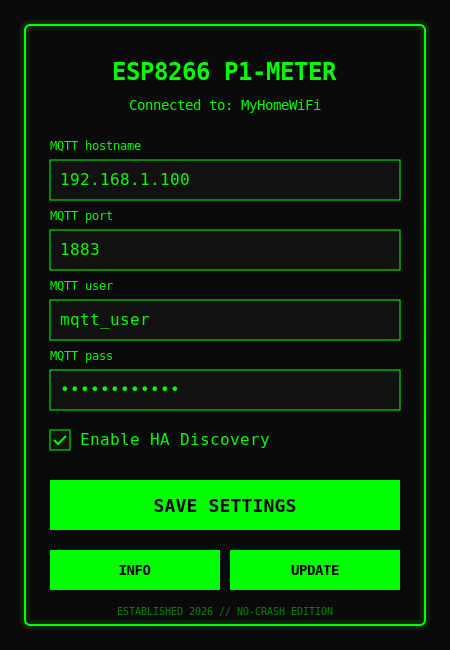

  _____ ____  ____   ___  ____   __      ____  _      __  __ _____ _____ _____ ____  
 | ____/ ___||  _ \ ( _ )(  _ \ / /_    |  _ \/ |    |  \/  | ____|_   _| ____|  _ \ 
 |  _| \___ \| |_) |/ _ \/ _ \ | '_ \   | |_) | |    | |\/| |  _|   | | |  _| | |_) |
 | |___ ___) |  __/| (_)  (_) || (_) |  |  __/| |    | |  | | |___  | | | |___|  _ < 
 |_____|____/|_|    \___/\___/ \___/   |_|   |_|    |_|  |_|_____| |_| |_____|_| \_\

# ⚡ ESP8266 P1-METER ⚡ [v1.5.0 - 2026 EDITION]

> "Stabilizing the grid, one telegram at a time." 🛠️💊

This is a high-performance, ultra-stable P1 Meter firmware for the **Wemos D1 Mini / ESP8266**. Re-engineered in 2026 to fix legacy buffer overflows, memory fragmentation, and bring true "plug-and-play" Home Assistant integration.

---

## 🚀 WHAT'S NEW IN v1.4.4 (THE "NON-BLOCKING" PATCH)

We went through the code with a fine-toothed comb to ensure this thing runs for months without a stutter. 

*   **⚡ ZERO-BLOCKING SERIAL (v1.4.4):** Completely refactored the P1 serial reading logic. It no longer uses blocking timeouts, ensuring the loop remains fast even when no data is arriving.
*   **🌐 NON-BLOCKING WEB-UI (v1.4.0):** The web server is now **Asynchronous**. It runs 24/7 without slowing down the P1 meter parsing. You can now perform browser-based OTA updates at `/update` anytime!
*   **🛡️ THE SANITY SHIELD (v1.3.1):** Every P1 telegram is now validated against physically impossible spikes. If a reading jumps more than 10kWh in 1 second, it is automatically discarded. No more vertical spikes in your HA Energy Dashboard!
*   **💾 RTC STATE AWARENESS (v1.3.1):** Critical totals are stored in **RTC User Memory** (SRAM). It survives soft-reboots and OTA updates without wearing out the Flash memory.
*   **⚡ 1s REAL-TIME UPDATES:** Polling interval reduced from 30s to 1s. Catch those power spikes as they happen.
*   **🧠 HEAP PROTECTION (Anti-Frag Engine):** Scrubbed all `String` and `std::vector` objects from the transmission loop. We parse the datagram entirely in-place. Zero allocations = zero memory "Swiss cheese" fragmentation = infinite uptime.
*   **🏠 PRO HOME ASSISTANT INTEGRATION:** 
    *   **Dynamic Discovery:** ESP now "listens" for 30s to see which sensors your meter actually provides before registering them in HA.
    *   **Branding:** Customizable Manufacturer, Model, and Friendly Name hardcoded in `settings.h`.
    *   **Native Energy Dashboard:** Fully tagged with the correct `state_class` and `device_class` to work out-of-the-box with HA's built-in Energy tracking.
    *   **LWT (Last Will & Testament):** If it loses power, Home Assistant immediately marks all sensors as "Unavailable".
*   **🕵️ SMART CHANGE DETECTION:** Only sends MQTT data if the value actually changes (with a 20s heartbeat). Saves your WiFi and your MQTT broker from unnecessary noise.
*   **🛡️ STACK SAFETY:** Moved large MQTT buffers to static memory. Say goodbye to Stack Overflows.
*   **💾 CRASH REPORTING:** If it reboots, it tells you *why* over MQTT (`/last_reset`). Milestone tracking pinpointing exactly where it failed.
*   **😎 HACKER WEB-UI:** The WiFi config portal has been upgraded with a lean, neon-green "terminal" aesthetic. Fully mobile-responsive and state-aware.
*   **🧱 BUFFER & EEPROM HARDENING:** Fixed the infamous `telegram` array overflow that was wiping WiFi settings, and added a read-before-write check to massively extend EEPROM lifespan.

---

## 🧠 DEEP DIVE: ARCHITECTURAL IMPROVEMENTS

### 🛡️ THE "ANTI-FRAG" ENGINE (Heap Protection)
The original code used `std::string`, `String`, and vectors for parsing. On an ESP8266, this is a death sentence. Every time you create a `String`, it allocates RAM. 
**v1.4.0** uses `snprintf`, direct `char*` pointer iteration, and fixed buffers. It reads data directly out of the raw byte array without creating copies. 

### 📉 SMART CHANGE DETECTION (Efficiency)
Modern P1 meters (DSMR 5.0) blast data every second. Sending 20+ MQTT messages every second is a massive waste of WiFi juice and CPU cycles. 
**v1.2.0** caches the last value of every single sensor. It only hits the radio if the value moves or if the 20s "heartbeat" timer hits. Your Home Assistant gets instant updates on power spikes, but stays quiet when nothing is happening. 🤫

### 🧬 POST-MORTEM TELEMETRY (Crash Debugging)
Ever wonder why your ESP just "stopped" responding? **v1.2.0** captures the `ResetReason` from the bootloader and the `Milestone` from RTC memory. 
- **Milestones:** We track if it was `Booting`, `WiFi Connecting`, `Reading P1`, or `Sending MQTT` when it died. 
- **MQTT Report:** On the next boot, it publishes the full autopsy report to `.../last_reset`.

---

## 🔌 CONNECTING TO THE P1 METER

Connect the esp8266 to an RJ11 cable/connector following the diagram.

**Note:** when using a 4-pin RJ11 connector (instead of a 6-pin connector), pin 1 and 6 are the pins that are not present, so the first pin is pin 2 and the last pin is pin 5

| P1 pin | ESP8266 Pin |
| :--- | :--- |
| 2 - RTS | 3.3v |
| 3 - GND | GND |
| 4 - | |
| 5 - RXD (data) | RX (gpio3) |

On most Landys and Gyr models a 10K resistor should be used between the ESP's 3.3v and the p1's DATA (RXD) pin. Many howto's mention RTS requires 5V (VIN) to activate the P1 port, but for me 3V3 suffices.

### Standard Wiring:

#### Optional: Powering the esp8266 using your DSMR5+ meter

When using a 6 pin cable you can use the power source provided by the meter.

| P1 pin | ESP8266 Pin |
| :--- | :--- |
| 1 - 5v out | 5v or Vin |
| 2 - RTS | 3.3v |
| 3 - GND | GND |
| 4 - | |
| 5 - RXD (data) | RX (gpio3) |
| 6 - GND | GND |

### Powered by Meter Wiring:

---

## 📡 MQTT TOPICS & METRICS

Your automations stay the same. We kept the legacy structure but made it faster and added missing 3-Phase metrics.

**Core Topics:**
| Topic | Description |
| :--- | :--- |
| `sensors/power/p1meter/actual_consumption` | Instant W usage |
| `sensors/power/p1meter/l1_instant_power_usage` | L1, L2, L3 Usage (W) |
| `sensors/power/p1meter/l1_voltage` | L1, L2, L3 Voltage (V) |
| `sensors/power/p1meter/frequency` | Line Frequency (Hz) |
| `sensors/power/p1meter/gas_meter_m3` | Gas Meter (m³) |
| `sensors/power/p1meter/last_reset` | Post-mortem crash report |
| `hass/status` | Online/Offline status with Version ID |

*(Note: Enabling Home Assistant Auto-Discovery does **not** change these topics. It just maps them for HA automatically).*

---

## 🎮 INSTALLATION

### Option 1: PlatformIO (Recommended)
1. Open the project folder in **VS Code** with the **PlatformIO** extension.
2. Edit `esp8266_p1meter/settings.h` for your specific needs (though defaults are now ⚡ cracked).
3. Click **Upload**. PlatformIO will automatically download all required libraries and flash the board.

### Option 2: Arduino IDE
1. Open `esp8266_p1meter/esp8266_p1meter.ino` in the Arduino IDE.
2. Go to **Sketch > Include Library > Manage Libraries...** and install the following:
   - `WiFiManager` by tzapu (v2.0+)
   - `PubSubClient` by Nick O'Leary
   - `DoubleResetDetector` by Stephen Denne
   - `ArduinoJson` by Benoit Blanchon (v7.0+)
   - `ESP Async WebServer` by me-no-dev
   - `ESPAsyncTCP` by me-no-dev
   - `ElegantOTA` by Ayush Sharma (**v3.1.0+**)
3. Edit `settings.h`, connect your board, and click **Upload**.

### First Boot Setup
1. Connect to the new `p1meter` WiFi Access Point.
2. You'll be greeted by the neon Hacker UI.
3. Feed it your WiFi and MQTT credentials.
4. Check the **"Enable HA Auto-Discovery"** box if you use Home Assistant.
5. Click Save. It will reboot and start streaming data!

### 🔄 How to change settings later (Re-accessing the WebUI)
For security and performance, the WebUI **shuts down** once the meter connects to your WiFi. If you ever need to change your MQTT broker IP or WiFi password, use the **Double Reset** method:
1. Press the physical **RST (Reset) button** on your D1 Mini.
2. Wait a second, then **press it again** (must be within 10 seconds of the first press).
3. The internal LED will start flashing rapidly, indicating the settings have been wiped.
4. The `p1meter` Access Point and WebUI will now be broadcasting again.

---

### 📜 VERSION HISTORY
- **v1.5.0** - 2026-03-22: Implemented ElegantOTA security tweaks. Added HTTP Basic Auth (`admin`), paused P1 parsing during updates to prevent buffer crashes, and added a graceful MQTT disconnect on successful firmware upload.
- **v1.4.9** - 2026-03-22: Increased the Hardware Serial RX buffer to 2048 bytes to prevent P1 telegram corruption and CRC failures during WebUI/MQTT blocking events.
- **v1.4.8** - 2026-03-22: Added an automatic HTTP redirect from the root path (`/`) to the OTA update page (`/update`) to prevent 404 errors.
- **v1.4.7** - 2026-03-22: Hotfix - Re-added `server.handleClient()` to restore the WebUI and fixed the Sanity Shield deadlock on zero-value metrics.
- **v1.4.6** - 2026-03-22: Reverted to Standard WebServer to fix `ESPAsyncWebServer` conflicts in Arduino IDE.
- **v1.4.4** - 2026-03-22: Non-blocking Serial parsing refactor. P1 meter data flow is now completely independent of WebServer/MQTT timing.
- **v1.4.3** - 2026-03-22: Hotfix - Resolved HTTP_GET conflict and AsyncWebServer conversion for Arduino IDE.
- **v1.4.2** - 2026-03-22: Migrated to latest **ElegantOTA v3**.
- **v1.4.1** - 2026-03-22: Enhanced Serial Debugging and increased serial timeout.
- **v1.4.0** - 2026-03-22: Non-blocking Async WebServer & ElegantOTA integration. OTA available 24/7 at `/update`.
- **v1.3.4** - 2026-03-22: Hotfix - Resolved reporting deadlock and added CRC debug logs.
- **v1.3.1** - 2026-03-22: Industrial Hardening (Sanity Shield, RTC Persistence).
- **v1.3.0** - 2026-03-22: Precision hardening and European locale support.
- **v1.2.6** - 2026-03-21: Implemented Dynamic HA Discovery.
- **v1.1.0** - Buffer overflow fixes and Crash milestones.
- **v1.0.0** - The OG release.

---

### ❤️ CREDITS
A huge thank you to [Daniel Jong](https://github.com/daniel-jong) for the original implementation and the foundation of this project. This 2026 edition builds upon his excellent work to provide even greater stability and native integration features.

**"Stay static, stay stable."** ✌️💀
